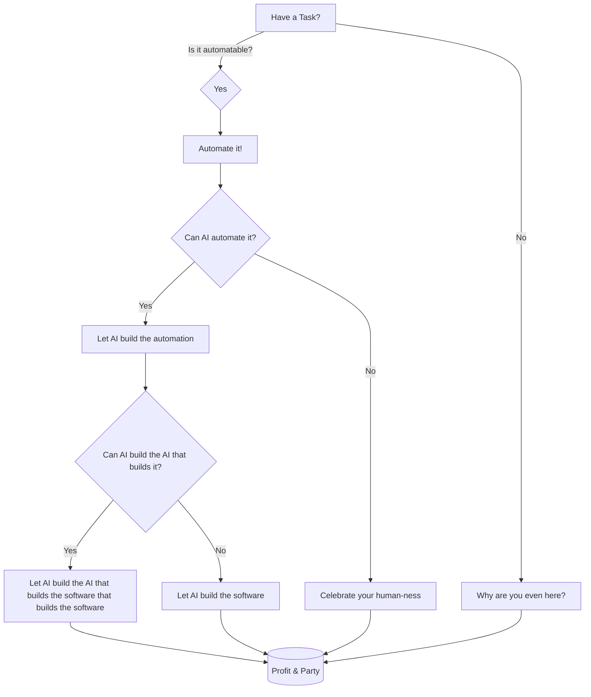

<!---
spetro511/spetro511 is a ✨ special ✨ repository because its `README.md` (this file) appears on your GitHub profile.
You can click the Preview link to take a look at your changes.
--->
# 👋 I’m **spetro511** — Welcome to My AI-Automated GitHub Universe!

---

## 🤖 Who Am I?

- 🧑‍💻 **Code wizard. Doc evangelist. Meme overlord.**
- 🏆 Building the future with AI-fueled automation.
- 🕶️ Workflow graphs? I design them in my sleep.
- 🧠 Orchestrating multi-agent systems before my coffee kicks in.
- 🚀 On a mission to make software smarter, faster, and way more fun.

---

## ⚡ Everything Powered by AI

- 🤖 **AI-First Philosophy:** If a human can do it, my bots already did.
- ⚡ **Automation Architect:** Workflow graphs, multi-agent orchestration — I make the pieces dance.
- 🧩 **Pioneering Workflows:** Designing the blueprints for tomorrow’s automation, today.
- 🛠️ **Epic CI/CD:** AI-driven pipelines, bots-on-bots, and more.

---

## 🚩 Where I Build

### 🏠 **Personal Projects**
- **[spetro511/spetro511](https://github.com/spetro511/spetro511)**
  - _My digital lab: AI, automation, and mind-blowing experiments unleashed._
  - 🤖 Bots everywhere. If it moves, I automate it.
  - 🧩 Workflow graph designs that make engineers weep (with joy).
  - 💬 Collabs, memes, existential rants — slide into my DMs.

### 🏢 **Organization Repos**
- **Pioneering automation at scale.**
  - 🛠️ Architect of intelligent CI/CD pipelines.
  - 🤝 Squad leader for AI-driven teams.
  - ⚙️ Automation that makes “it works on my machine” extinct.

### 🏛️ **Enterprise Adventures**
- **Enterprise-grade AI orchestration with startup swagger.**
  - 🔒 Secure, scalable, self-healing systems.
  - 🏗️ Platforms that don’t just run — they think.
  - 🏅 Docs that turn onboarding into a joyride.

---

## 🤝 New Partnership: [Suren’s Creations](https://SurensCreations.com)

- 🌟 Just launched a partnership with [a dear friend, much to come](https://SurensCreations.com)!
- 🎨 Suren brings epic creativity and portfolio firepower.
- 🤝 More joint projects and collabs coming soon — stay tuned.
- 🚀 Check out Suren’s work and our latest launches at [SurensCreations.com](https://SurensCreations.com).

---

## 🛠️ Tech Stack

`TypeScript` • `Python` • `Go` • `Docker` • `GitHub Actions`  
`AI/ML` • `Workflow Graphs` • `Multi-Agent Systems`  
`Markdown` (obsession level: 10/10) • `CI/CD` • `Cloud` • _Whatever tomorrow brings_

---

## 😂 Automation Philosophy, Illustrated

> **Pro tip:**  
> Don’t just use AI to build software.  
> Use AI to build software that builds software.  
> (And then automate THAT.)

---

## 📣 Connect With Me

- 💬 **DMs open** for collabs, code reviews, or meme duels.
- 📝 [See my latest AI creations](https://github.com/spetro511?tab=repositories)
- 🌐 [LinkedIn for the buttoned-up version](https://linkedin.com/in/spetro511)

---

> “Automate the boring. Orchestrate the complex. Document the epic.”  
> — _spetro511, probably plotting a new workflow_

---
